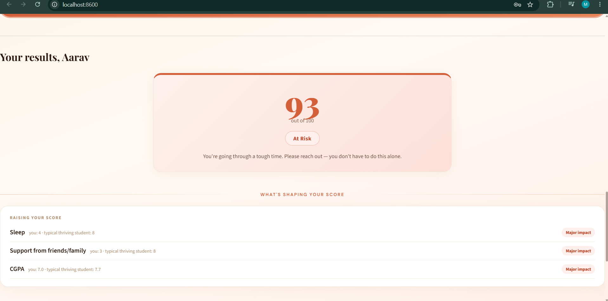
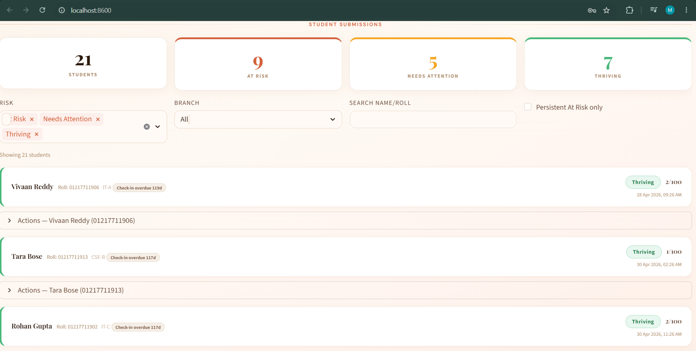
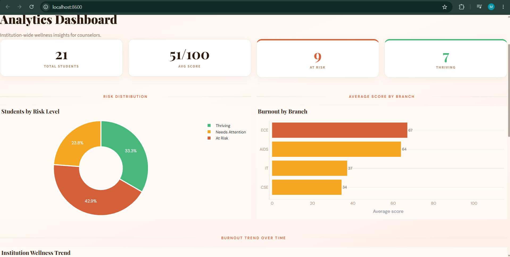
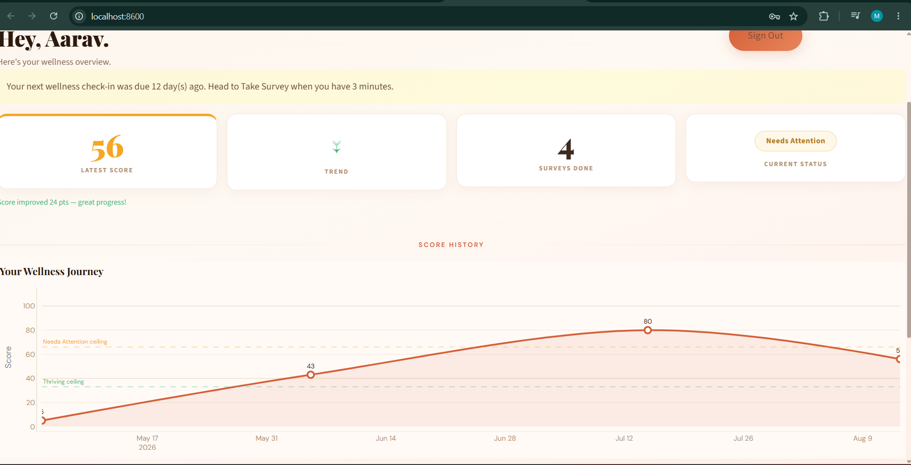
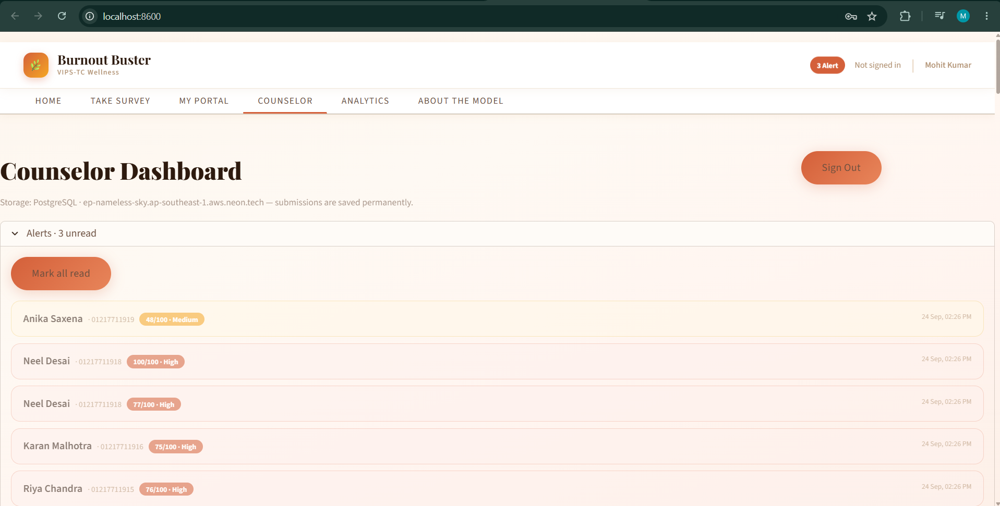
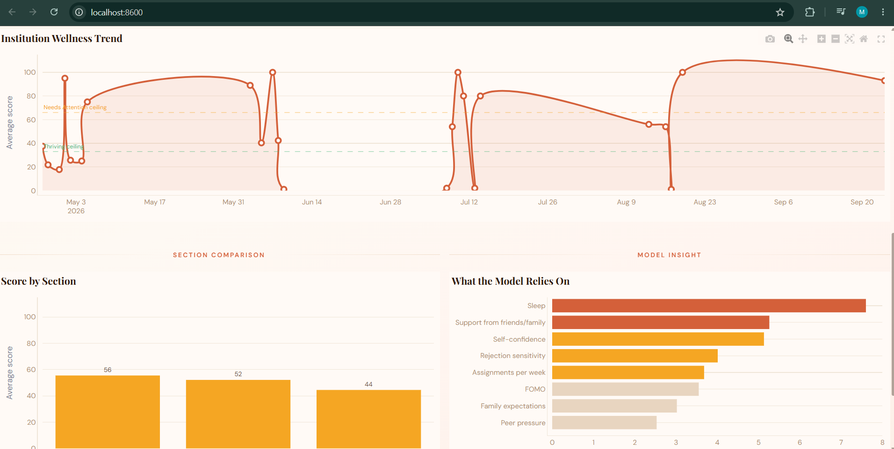
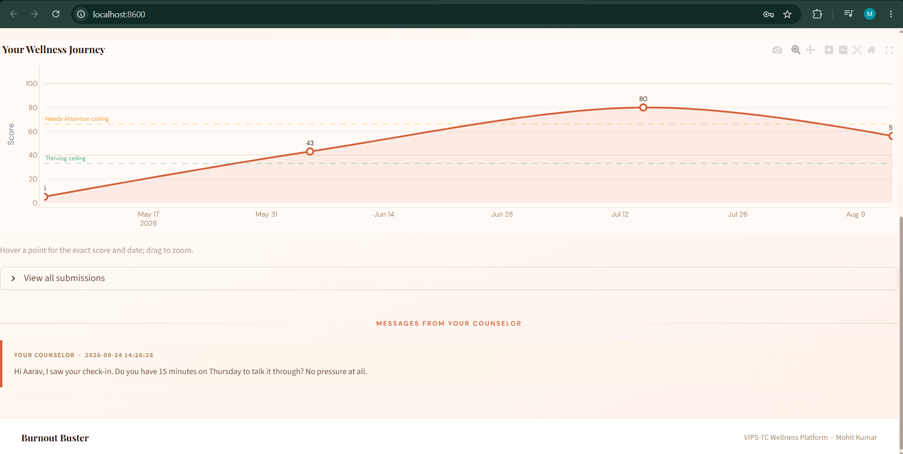

# 🔥 Burnout Buster

[](https://python.org)
[](https://streamlit.io)
[](https://github.com/mKs2609/burnout-buster/actions/workflows/tests.yml)
[](LICENSE)
[](https://burnout-buster-tp2wbhw5ctpsd3ggy8yzlc.streamlit.app/)

**A wellness check-in for students, and an early-warning dashboard for the counselors who support them.**

**🔗 Try it:** [burnout-buster-tp2wbhw5ctpsd3ggy8yzlc.streamlit.app](https://burnout-buster-tp2wbhw5ctpsd3ggy8yzlc.streamlit.app/)

> Built at VIPS-TC College of Engineering by **Mohit Kumar** (AIDS-A, Batch 2024)

---

## What it does

Burnout builds up quietly. By the time a student says something, they are often already
deep in it — and a counselor supporting hundreds of students has no way to know who is
struggling until someone asks for help.

Burnout Buster gives both sides something to work with.

**For a student — three minutes, twice a semester:**

1. Answer 17 questions about coursework, social pressure, sleep, exercise and how you have been feeling.
2. Get a **wellness score out of 100** and, more usefully, **the reasons behind it** — which answers pushed your score up, and which are helping you.
3. Get a short action plan built from those same reasons, plus helpline numbers if things look serious.

**For a counselor:**

1. See every student's latest result on one dashboard, sorted and filterable by risk, branch or name.
2. Get alerted when someone scores high, and flagged when the same student scores high twice in a row.
3. Send a private message, record what action was taken, and see who is overdue for a check-in.

Students only see their own results. Counselors see the whole picture.

---

## Screenshots

| A student's result — the score, the reasons, and what to do next | The counselor's dashboard |
| --- | --- |
|  |  |
| **Institution-wide analytics** | **The student's own portal over time** |
|  |  |

<details>
<summary>More screens</summary>

| Counselor alerts | Trend, sections and model insight | Counselor messages in the portal |
| --- | --- | --- |
|  |  |  |

</details>

*All screenshots use fictional demo data — no real student records.*

---

## Contents

- [What it does](#what-it-does)
- [How the score works](#how-the-score-works)
- [What makes it trustworthy](#what-makes-it-trustworthy)
- [Quick start](#quick-start)
- [The model in detail](#the-model-in-detail)
- [Storage](#storage)
- [Security and privacy](#security-and-privacy)
- [Tests](#tests)
- [Deployment](#deployment)
- [Project structure](#project-structure)
- [Limitations](#limitations)
- [SDG alignment](#sdg-alignment)
- [Crisis resources (India)](#crisis-resources-india)
- [Roadmap](#roadmap)
- [License](#license)

---

## How the score works

Every check-in produces one number from 0 to 100. Higher means more strain.

| Score | Level | What it means |
| --- | --- | --- |
| 0–33 | 🟢 **Thriving** | Current habits are supporting you |
| 34–66 | 🟡 **Needs Attention** | Some stress signals worth acting on |
| 67–100 | 🔴 **At Risk** | Significant strain — please reach out |

That one number is the single source of truth: the student and the counselor always see
the same level for the same check-in.

**The score is explained, not just announced.** Each result lists the answers raising it and
the answers helping, compared with a typical thriving student:

> **Raising your score** — Sleep (you: 4 · typical thriving student: 8) · *Major impact*
> **Helping you** — Support from friends/family (you: 9 · typical: 8) · *Moderate*

**Some answers matter on their own.** Sleeping four hours or less, carrying four or more
backlogs, or having almost no support will lift a score to at least *Needs Attention*, however
healthy everything else looks — and the student is told which rule applied and why.

---

## What makes it trustworthy

Anyone can ship a model that outputs a number. These are the parts that make the number
worth acting on:

- **It cannot contradict common sense.** The model is built with *monotonic constraints*: more sleep, more support or more exercise can never *raise* a burnout score, and more backlogs can never *lower* one. This is guaranteed by the model's structure, not hoped for.
- **It explains every score**, so a counselor can sanity-check the reasoning instead of trusting a black box.
- **It reports honest numbers.** ~83% accuracy on 1,000 students held back from training — not the suspicious 99–100% that synthetic data usually produces. It never confuses *Thriving* with *At Risk* (0.3% of cases).
- **It is benchmarked**, including against a do-nothing baseline, so you can see what the model actually adds.
- **It refuses to ship if it misbehaves.** Training runs 8 sanity checks (e.g. "a student sleeping 3 hours is never Thriving") and aborts without saving if any fails.
- **It says what it doesn't know.** The app's *About the Model* tab states plainly that training data is simulated, and shows the confusion matrix and model comparison.

---

## Quick start

```bash
git clone https://github.com/mKs2609/burnout-buster.git
cd burnout-buster
pip install -r requirements.txt
```

Create `.streamlit/secrets.toml` from [the template](.streamlit/secrets.toml.example):

```toml
COUNSELOR_PASSWORD = "choose-a-strong-password"
```

Then build the dataset, train the model and run the app:

```bash
python generate_dataset.py    # 5,000 simulated responses
python train_model.py         # trains, evaluates, writes the model card
streamlit run app.py
```

Open [localhost:8501](http://localhost:8501). The database is created automatically on first run.

---

## The model in detail

Burnout risk is **ordered** (Low < Medium < High). Rather than one multiclass classifier,
two binary gradient-boosting models estimate:

- **P(at least Needs Attention)**
- **P(At Risk)**

**Score = 50 × P(≥ Needs Attention) + 50 × P(At Risk)** → a full 0–100 range.

This split (the Frank & Hall ordinal approach) is what makes the guarantees possible:
monotonic constraints work on binary classifiers but not on multiclass ones. Each feature is
constrained by direction — sleep, support, exercise, diet, confidence and CGPA can only lower
a score; workload, backlogs, FOMO, social media and rejection sensitivity can only raise it.
Study hours are left unconstrained (too little and too much both hurt), as are counselor
visits (a sign of struggling, but also of getting help).

**Performance** (1,000 held-out students):

| Metric | Value |
| --- | --- |
| Accuracy | ~83% |
| Macro F1 | ~82% |
| Thriving ↔ At Risk confusion | 0.3% |
| Compared against | majority-class baseline, logistic regression, random forest, plain boosting |

**Explanations** compare each answer with a typical thriving student's, measured in log-odds
so factors still rank correctly when a score saturates at 0 or 100.

**The training data is simulated.** No real student records were available, so
[`generate_dataset.py`](generate_dataset.py) builds 5,000 responses that behave like real survey data:
answers driven by shared hidden factors (so they correlate as real answers do), a noisy hidden
burnout index (so the risk levels genuinely overlap), and 5% careless responders who click
straight down the middle. Swap in real consented responses with counselor-confirmed levels and
[`train_model.py`](train_model.py) runs unchanged.

### What's measured

| Category | Questions |
| --- | --- |
| Academic | Exams/month, assignments/week, attendance pressure, CGPA, backlogs, study hours |
| Social | FOMO, peer pressure, family expectations, social media hours, rejection sensitivity |
| Lifestyle | Sleep hours, exercise days, diet quality |
| Emotional | Self-confidence, support system, counselor visits |

---

## Storage

SQL through SQLAlchemy ([`database.py`](database.py)). Tables — `students`, `submissions`, `replies`,
`counselor_actions`, `reminders`, `college_records`, `notifications` — are created on first run.

| Setup | When to use |
| --- | --- |
| **SQLite** (default, no config) | Local development and demos |
| **PostgreSQL** — set `DATABASE_URL` (e.g. free [Neon](https://neon.tech) or [Supabase](https://supabase.com)) | Any real deployment. Streamlit Cloud wipes local files on restart, so SQLite data would be lost there |

The counselor dashboard shows which backend is live, so a misconfigured `DATABASE_URL` can't
silently leave the app writing to storage that disappears on the next restart.

---

## Security and privacy

- Passwords hashed with **bcrypt** and a per-user salt; accounts created before that upgrade automatically on next login
- Minimum 8-character passwords; the counselor password lives only in secrets, never in the code
- Portal login requires roll number **+** password **+** branch **+** section, and each roll number can only be registered once
- Every piece of student-written text is escaped before it reaches the page
- Saves report failure instead of showing a success message that wasn't true
- `.gitignore` keeps secrets, the database and student data out of the repository

---

## Tests

```bash
pip install -r requirements-dev.txt
python -m pytest
```

74 tests covering the model's guarantees (monotonicity, safety rules, explanations), the
storage layer (accounts, password upgrades, alerts, failure handling) and full UI flows
(registration, impersonation attempts, counselor actions, HTML-injection attempts, reminders).
They run against a temporary database and never touch real data.

Every push runs them on GitHub Actions ([`.github/workflows/tests.yml`](.github/workflows/tests.yml)), which also
verifies the committed model still scores a healthy profile as *Thriving* and a sleep-deprived
one as not.

---

## Deployment

Live on Streamlit Community Cloud. To deploy your own copy:

1. Create a free account at [streamlit.io/cloud](https://streamlit.io/cloud)
2. Push this repo to GitHub
3. **New App** → connect the repo → main file `app.py`
4. In **Settings → Secrets**, add `COUNSELOR_PASSWORD`, and `DATABASE_URL` so data survives restarts
   (top-level keys must sit above any `[section]` line)
5. Deploy — you get a public URL in about two minutes

---

## Project structure

```
app.py              page shell and tab routing
views/              one module per tab (home, survey, portal, counselor, analytics, model_card)
scoring.py          the model, safety rules and per-student explanations
database.py         SQLAlchemy schema and all data access
charts.py           interactive Plotly charts
ui.py               stylesheet, navbar, footer, shared markup
utils.py            check-in dates, latest-per-student, formatting
advice.py           action-plan tips
constants.py        branches, sections, labels, palette
generate_dataset.py builds the simulated training set
train_model.py      trains, evaluates, writes the model card
migrate_csv_to_db.py one-time CSV → database import
tests/              74 pytest tests
```

---

## Limitations

Worth being straight about:

- **The model learned from simulated data.** It behaves sensibly and is honestly measured, but it has never seen a real student. Treat scores as a conversation starter, not evidence.
- **It is a screening aid, not a diagnosis.** No screening tool replaces a trained counselor.
- **Self-reported answers can be wrong** — under-reporting, careless clicking, or someone answering how they think they should. The uploaded academic-records cross-check helps a little; honest use helps more.
- **One shared counselor password.** Fine for a pilot with one counselor; a real rollout needs individual accounts.

---

## SDG alignment

| SDG | Connection |
| --- | --- |
| SDG 3 — Good Health & Well-being | Early mental health detection |
| SDG 4 — Quality Education | Reducing dropout linked to burnout |
| SDG 10 — Reduced Inequalities | Supporting students who would not otherwise ask |

## Crisis resources (India)

If you or someone you know is struggling, help is available:

| Helpline | Number |
| --- | --- |
| iCall (TISS) | 9152987821 |
| Vandrevala Foundation | 1860-2662-345 (24/7) |
| NIMHANS | 080-46110007 |
| Snehi | 044-24640050 |

**This tool is not a clinical diagnostic tool and does not replace professional mental health
evaluation.** If you are in crisis, please contact one of the helplines above or your local
emergency services.

---

## Roadmap

- [x] Unit tests for the model, storage and app flows
- [x] Explain every prediction with the factors behind it
- [x] Screenshots and a license
- [ ] Validate against real, consented student responses in a pilot
- [ ] Individual counselor accounts instead of one shared password
- [ ] Email / WhatsApp notifications for counselors

## License

[MIT](LICENSE) © 2026 Mohit Kumar

## Author

**Mohit Kumar**
AIDS-A, Batch 2024 — VIPS-TC College of Engineering
GitHub: [@mKs2609](https://github.com/mKs2609)

---

*Made with ❤️ at VIPS-TC | AIDS-A Batch 2024*
